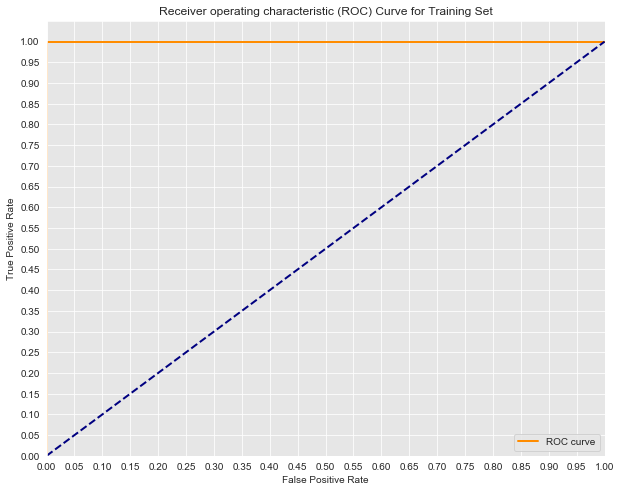

# ROC Curves and AUC - Lab


## Introduction 

In this lab, you'll practice drawing ROC graphs, calculating AUC, and interpreting these results. In doing so, you will also further review logistic regression, by briefly fitting a model as in a standard data science pipeline.

## Objectives

You will be able to:

* Evaluate classification models using various metrics
* Define and understand ROC and AUC

## Training the Model

Start by repeating the previous modelling steps we have discussed. For this problem, you are given a dataset **mushrooms.csv**. Your first job is to train a LogisticRegression classifier on the dataset to determine whether the mushroom is **e**dible or **p**oisonous. The first column of the dataset *class* indicates whether or not the mushroom is poisonous or edible.

**For consistency use random_state = 0**


```python
#Your code here
from sklearn.linear_model import LogisticRegression
from sklearn.model_selection import train_test_split
import pandas as pd


#Load the data
df = pd.read_csv('mushrooms.csv')

#Data Preview
df.head()
```


<div>
<style scoped>
    .dataframe tbody tr th:only-of-type {
        vertical-align: middle;
    }

    .dataframe tbody tr th {
        vertical-align: top;
    }

    .dataframe thead th {
        text-align: right;
    }
</style>
<table border="1" class="dataframe">
  <thead>
    <tr style="text-align: right;">
      <th></th>
      <th>class</th>
      <th>cap-shape</th>
      <th>cap-surface</th>
      <th>cap-color</th>
      <th>bruises</th>
      <th>odor</th>
      <th>gill-attachment</th>
      <th>gill-spacing</th>
      <th>gill-size</th>
      <th>gill-color</th>
      <th>...</th>
      <th>stalk-surface-below-ring</th>
      <th>stalk-color-above-ring</th>
      <th>stalk-color-below-ring</th>
      <th>veil-type</th>
      <th>veil-color</th>
      <th>ring-number</th>
      <th>ring-type</th>
      <th>spore-print-color</th>
      <th>population</th>
      <th>habitat</th>
    </tr>
  </thead>
  <tbody>
    <tr>
      <th>0</th>
      <td>p</td>
      <td>x</td>
      <td>s</td>
      <td>n</td>
      <td>t</td>
      <td>p</td>
      <td>f</td>
      <td>c</td>
      <td>n</td>
      <td>k</td>
      <td>...</td>
      <td>s</td>
      <td>w</td>
      <td>w</td>
      <td>p</td>
      <td>w</td>
      <td>o</td>
      <td>p</td>
      <td>k</td>
      <td>s</td>
      <td>u</td>
    </tr>
    <tr>
      <th>1</th>
      <td>e</td>
      <td>x</td>
      <td>s</td>
      <td>y</td>
      <td>t</td>
      <td>a</td>
      <td>f</td>
      <td>c</td>
      <td>b</td>
      <td>k</td>
      <td>...</td>
      <td>s</td>
      <td>w</td>
      <td>w</td>
      <td>p</td>
      <td>w</td>
      <td>o</td>
      <td>p</td>
      <td>n</td>
      <td>n</td>
      <td>g</td>
    </tr>
    <tr>
      <th>2</th>
      <td>e</td>
      <td>b</td>
      <td>s</td>
      <td>w</td>
      <td>t</td>
      <td>l</td>
      <td>f</td>
      <td>c</td>
      <td>b</td>
      <td>n</td>
      <td>...</td>
      <td>s</td>
      <td>w</td>
      <td>w</td>
      <td>p</td>
      <td>w</td>
      <td>o</td>
      <td>p</td>
      <td>n</td>
      <td>n</td>
      <td>m</td>
    </tr>
    <tr>
      <th>3</th>
      <td>p</td>
      <td>x</td>
      <td>y</td>
      <td>w</td>
      <td>t</td>
      <td>p</td>
      <td>f</td>
      <td>c</td>
      <td>n</td>
      <td>n</td>
      <td>...</td>
      <td>s</td>
      <td>w</td>
      <td>w</td>
      <td>p</td>
      <td>w</td>
      <td>o</td>
      <td>p</td>
      <td>k</td>
      <td>s</td>
      <td>u</td>
    </tr>
    <tr>
      <th>4</th>
      <td>e</td>
      <td>x</td>
      <td>s</td>
      <td>g</td>
      <td>f</td>
      <td>n</td>
      <td>f</td>
      <td>w</td>
      <td>b</td>
      <td>k</td>
      <td>...</td>
      <td>s</td>
      <td>w</td>
      <td>w</td>
      <td>p</td>
      <td>w</td>
      <td>o</td>
      <td>e</td>
      <td>n</td>
      <td>a</td>
      <td>g</td>
    </tr>
  </tbody>
</table>
<p>5 rows × 23 columns</p>
</div>


```python
#Further data previews
df.info()
```

    <class 'pandas.core.frame.DataFrame'>
    RangeIndex: 8124 entries, 0 to 8123
    Data columns (total 23 columns):
    class                       8124 non-null object
    cap-shape                   8124 non-null object
    cap-surface                 8124 non-null object
    cap-color                   8124 non-null object
    bruises                     8124 non-null object
    odor                        8124 non-null object
    gill-attachment             8124 non-null object
    gill-spacing                8124 non-null object
    gill-size                   8124 non-null object
    gill-color                  8124 non-null object
    stalk-shape                 8124 non-null object
    stalk-root                  8124 non-null object
    stalk-surface-above-ring    8124 non-null object
    stalk-surface-below-ring    8124 non-null object
    stalk-color-above-ring      8124 non-null object
    stalk-color-below-ring      8124 non-null object
    veil-type                   8124 non-null object
    veil-color                  8124 non-null object
    ring-number                 8124 non-null object
    ring-type                   8124 non-null object
    spore-print-color           8124 non-null object
    population                  8124 non-null object
    habitat                     8124 non-null object
    dtypes: object(23)
    memory usage: 1.4+ MB


```python
#Define appropriate X and y
X = df[df.columns[1:]]
y = pd.get_dummies(df["class"]).iloc[:,1]

#Creat Dummy Variables
X = pd.get_dummies(X)
# Split the data into train and test sets.
X_train, X_test, y_train, y_test = train_test_split(X, y, random_state=42)

#Fit a model
logreg = LogisticRegression(fit_intercept = False, C = 1e12) #Starter code
model_log = logreg.fit(X_train, y_train)
print(model_log) #Preview model params

#Predict
y_hat_test = logreg.predict(X_test)
```

    LogisticRegression(C=1000000000000.0, class_weight=None, dual=False,
              fit_intercept=False, intercept_scaling=1, max_iter=100,
              multi_class='ovr', n_jobs=1, penalty='l2', random_state=None,
              solver='liblinear', tol=0.0001, verbose=0, warm_start=False)


## ROC Metrics
  
Next, calculate the false positive rate and true positive rate (you can use the built-in metrics from sci-kit learn) of your classifier.


```python
# Your code here
from sklearn.metrics import roc_curve, auc

#for various decision boundaries given the case member probabilites

#First calculate the probability scores of each of the datapoints:
y_score = model_log.decision_function(X_test)

fpr, tpr, thresholds = roc_curve(y_test, y_score)

y_train_score = model_log.decision_function(X_train)
train_fpr, train_tpr, thresholds = roc_curve(y_train, y_train_score)
```

## Drawing the ROC Graph

Next, use the false positive rate and true positive rate to plot the Receiver Operating Characteristic Curve for both the train and test sets.


```python
import matplotlib.pyplot as plt
import seaborn as sns
%matplotlib inline

#Seaborns Beautiful Styling
sns.set_style("darkgrid", {"axes.facecolor": ".9"})

plt.figure(figsize=(10,8))
lw = 2
plt.plot(fpr, tpr, color='darkorange',
         lw=lw, label='ROC curve')
plt.plot([0, 1], [0, 1], color='navy', lw=lw, linestyle='--')
plt.xlim([0.0, 1.0])
plt.ylim([0.0, 1.05])
plt.yticks([i/20.0 for i in range(21)])
plt.xticks([i/20.0 for i in range(21)])
plt.xlabel('False Positive Rate')
plt.ylabel('True Positive Rate')
plt.title('Receiver operating characteristic (ROC) Curve for Test Set')
plt.legend(loc="lower right")
print('AUC: {}'.format(auc(fpr, tpr)))
plt.show()
```

    AUC: 1.0


```python
#Seaborns Beautiful Styling
sns.set_style("darkgrid", {"axes.facecolor": ".9"})

plt.figure(figsize=(10,8))
lw = 2
plt.plot(train_fpr, train_tpr, color='darkorange',
         lw=lw, label='ROC curve')
plt.plot([0, 1], [0, 1], color='navy', lw=lw, linestyle='--')
plt.xlim([0.0, 1.0])
plt.ylim([0.0, 1.05])
plt.yticks([i/20.0 for i in range(21)])
plt.xticks([i/20.0 for i in range(21)])
plt.xlabel('False Positive Rate')
plt.ylabel('True Positive Rate')
plt.title('Receiver operating characteristic (ROC) Curve for Training Set')
plt.legend(loc="lower right")
print('AUC: {}'.format(auc(train_fpr, train_tpr)))
plt.show()
```

    AUC: 1.0





## Interpretation:

What do you notice about these ROC curves?

## Your answer here
Both have an AUC of 1.0, indicating their performance is perfect. Note that this is an extreme rarity! Typically, if models perform this well it is too good to be true.

## Interpretation
Look at the ROC curve graph from the lesson:  


Think about the scenario of this model: predicting heart disease. If you tune the current model to have an 82% True Positive Rate, (you've still missed 20% of those with heart disease), what is the False positive rate?


```python
fp = .17 #write the approximate fpr when tpr=.8
```

## Interpretation 2
If you instead tune the model to have a 95.2% True Postive Rate, what will the False Postive Rate be?


```python
fp = .22 #write the approximate fpr when tpr=.95
```

## Opinion
In the case of heart disease dataset that we've been talking about, do you find any of the above cases acceptable? How would you tune the model? Describe what this would mean in terms of the number of patients falsely scared of having heart disease and the risk of missing the warning signs for those who do actually have heart disease.

## Your answer here

With such an important decision, such as detecting heart disease, we would hope for more accurate results. The True positive weight is the more important of the two in this scenario. That is, the true positive rate determines the percentage of patients with heart disease who are correctly identified and warned. The false positive rate is still very important, but it would be better rather accidentally scare a few healthy patients and warn them of potentially having heart disease then having missed warnings. That said, the false positive rate becomes rather unacceptably high once the true positive rate exceeds .95. A .95 TPR indicates that out of 100 patients with heart disease we correctly warn 95 of them, but fail to warn 5. At the same time, this has a FPR of nearly .25 meaning that roughly one in four times we incorrectly warn a patient of heart disease when they are actually healthy.

## Summary

In this lab you further explored ROC curves and AUC, drawing graphs and then interpreting these results to lead to a more detailed and contextualized understanding of your model's accuracy.
